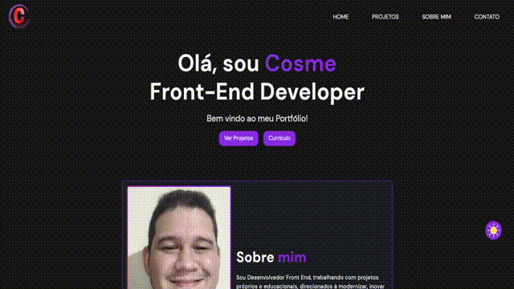

# E aqui estamos nós! Último Projeto do #VaiNaWeb :grinning: :purple_heart:

#### O que foi pedido:
- Criar um portfólio e BLOG pessoal, com projetos já executados.
- A página deve ter uso de rotas, pelo menos um.
- Além disso, Projeto de Desenvolvimento Sustentável abordando problemas dá sua localidade.

#### Ferramentas Utilizada:

   
   

  
## Preview:
#### - Desktop:

#### - Tablet:

#### - Mobile:

## Créditos:
<h4>- Designs:</h4> 
<li>@miguel_rt (Base geral do Portfólio)</li> 
<li>@pavanmg007 (Também usei os Cards como base assim como a parte de Tech's.</li>
<li>@melocoder (Usei como base o Cards)</li>

<h4>- Error Page:</h4> 
<li>@Tech5hu</li>

<h4>- Texto:</h4> 
<li>Obrigado especial a Luciana Lima que deu uma melhorada nos textos :relaxed:.</li>

<h2>Link: https://csl-portfolio.netlify.app/</h2>

